> **"Code. Design. Innovate."**
> Passionate about **UI/UX design, software development, and building seamless digital experiences**.

 

<h3><code>MadhavSinha007@github ~ $ aboutme</code></h3>

<table>
  <tr>
    <td valign="top"></td>
    <td valign="top"></td>
  </tr>
</table>

 

## More of Me:

